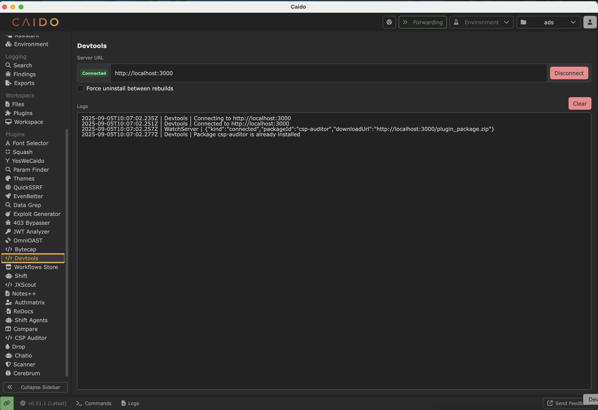

# Devtools

This is a companion plugin designed for developing Caido plugins. It should be used in conjunction with the [caido-dev](https://github.com/caido-community/dev) toolkit.

## Features

- Automatically reloads the plugin whenever code changes are detected, making plugin development faster and more efficient.

## How to Use

1. Execute the command `pnpm watch` to start a watch server. Example output:
   ```
    > csp-auditor@1.0.0 watch /Users/ads/git/csp-auditor
    > caido-dev watch

    [*] Loading configuration: /Users/ads/git/csp-auditor/caido.config.ts
    [*] Building plugin package
    [*] Loading configuration: /Users/ads/git/csp-auditor/caido.config.ts
    [*] Building backend plugin: /Users/ads/git/csp-auditor/packages/backend
    CLI Building entry: packages/backend/src/index.ts
    CLI Using tsconfig: tsconfig.json
    CLI tsup v8.3.5
    CLI Target: esnext
    CLI Cleaning output folder
    ESM Build start
    ESM packages/backend/dist/index.js 27.34 KB
    ESM ⚡️ Build success in 126ms
    [*] Backend built successfully
    [*] Building frontend plugin: /Users/ads/git/csp-auditor/packages/frontend
    vite v6.0.7 building for production...
    ✓ 95 modules transformed.
    dist/index.css    9.68 kB │ gzip:   2.10 kB
    dist/index.js   947.18 kB │ gzip: 186.36 kB
    ✓ built in 806ms
    [*] Frontend plugin built successfully
    [*] Bundling plugin package
    [*] Validating manifest data
    [*] Plugin package zip file created successfully
    [*] Plugin package built successfully
    [*] Development server running at http://localhost:3000
    [*] WebSocket server running at ws://localhost:3000
   ```
2. Copy the server URL and paste it into the Server URL field (in this case, `http://localhost:3000`) of this plugin.
3. Click the Connect button to connect to the watch server.



This should load the plugin in the Caido instance. Any changes you make to the code will be reflected in the plugin.
